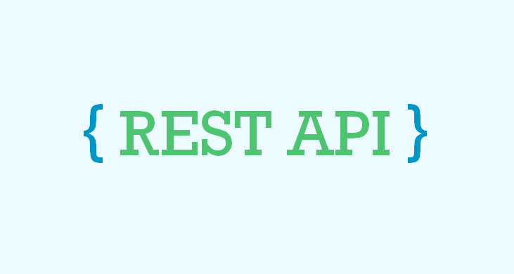

# REST API Сервис закупок
Проект базирован на платформе **Django**.

Данный репозиторий является **Дипломной работой**.

Идея не оригинальна.


___

**Developers:**

Журавлев Андрей / Andrew Markos


## 🧐 Что это?

**REST API** - Representational State Transfer **(REST)** — это программная архитектура, которая определяет условия работы **API**.

Разработчики могут создавать API с использованием нескольких архитектур. API-интерфейсы, соответствующие архитектурному стилю REST, называются REST API. Веб-службы, реализующие архитектуру REST, называются веб-службами RESTful. Как правило, термин RESTful API относится к сетевым RESTful API.

Данный репозиторий показывает работу **Django** для **REST API** использования.

## 🔎 Документация

Документациия по использованию **REST API**  [здесь](/rest_api_doc.md)


## 🛠️ Начало работы

1. Для работы проекта потребуются библиотеки, перечисленные в файле `requirements.txt`, для запуска проекта отправить в терминал:

    ```
    pip install requirements.txt
    ```
2. Для создания подключения к базе необходимо установить **Docker daemon**.
Далее нужно создать файл **.env**, в которые мы передаём следующие параметры:

    ```
    POSTGRES_USER=ordersadmin
    POSTGRES_PASSWORD=yourpassword
    POSTGRES_DB=orders
    POSTGRES_HOST=localhost
    POSTGRES_PORT=5431
    ```
Переменные необходимы для инициализации базы данных через **Docker** и с последующим использованием их в **Django**.

Запуск базы данных из под **Docker** осуществляется командой в терминал:

```
    docker-compose up
```

Запуск Redis для работы с **Celery** из под **Docker**:

```
    docker run -d -p 6379:6379 redis
```

Запуск **Celery**:

```
    celery -A orders worker -l info
```


3. Необходимо внести данные для работы **Django**:

В файле `orders/orders/settings.py` проверить переменные базы данных:
```
DATABASES = {
    'default': {
        'ENGINE': 'django.db.backends.postgresql',
        'NAME': 'orders',
        'HOST': 'localhost',
        'PORT': '5431',
        'USER': 'ordersadmin',
        'PASSWORD': 'netologypassword'
    }
}
```

Для работы почтового сервиса указать данные для **SMTP**:

```
EMAIL_BACKEND = 'django.core.mail.backends.smtp.EmailBackend'


EMAIL_HOST = 'your.host.com'
EMAIL_HOST_USER = 'your@mail.com'
EMAIL_HOST_PASSWORD = 'token/password'
EMAIL_PORT = '465'
EMAIL_USE_SSL = True
EMAIL_USE_TLS = False
DEFAULT_FROM_EMAIL = 'default@mail.com'
```
4. Запустить **Django** проект:
```
python manage.py runserver
```

5. Если Вы уже зарегистрировали как минимум `двух продавцов`, то Вам необходимо загрузить первоначальные данные магазинов в базу данных при помощи функции `loaddata` в `Django`. Найти их можно в `orders/mtv/fixtures`. Загрузка данных выполняется при помощи команды в терминал:
```
python manage.py loaddata <Название файла.json>
```
Если нет, то прочитайте документацию для `REST API` и вернитесь обратно.

